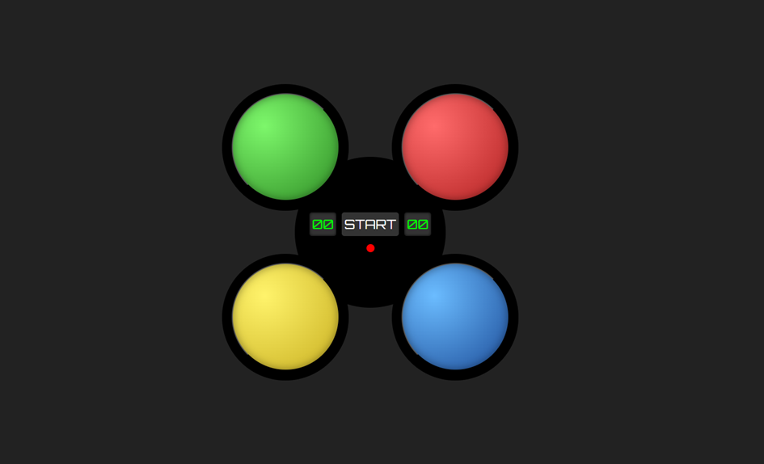

# simon-says-async

This was Assignment 2 for my CS230 Web Information Processing module at Maynooth University.

The goal was to recreate the Simon game using only HTML, CSS and JavaScript. The game generates a random sequence of colours which the player must remember and repeat. Each round adds a new colour, making the sequence longer and harder to remember.

---

## Screenshot

---

## Features

- Sequence is shown and then there is a 5 second timer for the player to respond.
- Increasing difficulty as the game progresses
- High score saved using Local Storage
- 5 second response timer
- Start/Restart functionality
- Visual game status indicator (the dot under the start button)

---

## Built With

- HTML
- CSS
- JavaScript

---

## What I Learned

This project helped me get more comfortable with JavaScript, asynchronous programming, DOM manipulation, event handling, and managing application state. It was also my first time building a larger interactive game using async/await, Promises, timers, and Local Storage.

I also wrote an article explaining and teaching what I learnt through this project. You can read it [here](https://medium.com/@gillhardeepkaur2000/everything-i-learned-about-asynchronous-javascript-by-building-a-tiny-game-f3a656e62f0b)
